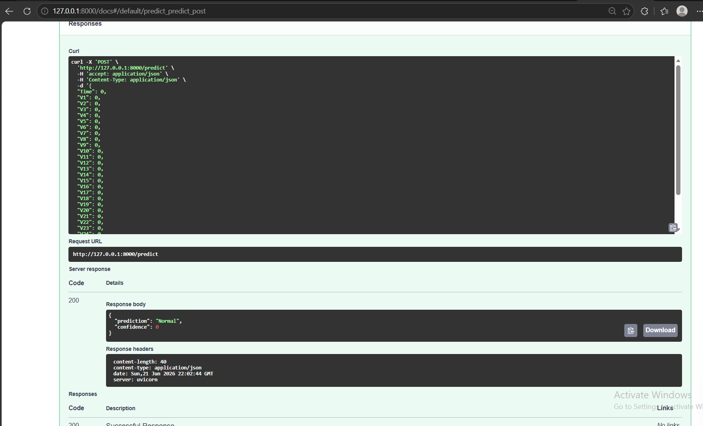

# 💳 Credit Card Fraud Detection API

<p align="center">
  
</p>

<p align="center">
  <b>Machine Learning + FastAPI Project for Real-Time Credit Card Fraud Detection</b>
</p>

---

## 📌 Overview

This project uses Machine Learning to detect fraudulent credit card transactions and exposes the trained model through a FastAPI REST API.

The model is trained using a Random Forest Classifier on the Credit Card Fraud Detection dataset and can classify transactions as:

* ✅ Normal Transaction
* 🚨 Fraudulent Transaction

The API returns both the prediction and a confidence score.

---

## 🚀 Features

* Credit Card Fraud Detection
* Random Forest Classification
* Imbalanced Data Handling
* Fraud Probability Score
* FastAPI REST API
* Swagger UI Documentation
* Model Serialization with Joblib
* Real-Time Predictions

---

## 📂 Project Structure

```text
07-credit-card-fraud-api/
│
├── creditcard.csv
├── fraud_model.pkl
├── train_model.py
├── main.py
├── requirements.txt
├── swagger-ui.png
└── README.md
```

---

## 📊 Dataset

### Credit Card Fraud Detection Dataset

The dataset contains anonymized credit card transactions.

### Features

```text
Time
V1
V2
V3
...
V28
Amount
```

### Target Variable

```text
Class = 0 → Normal Transaction
Class = 1 → Fraudulent Transaction
```

### Dataset Statistics

| Metric                  | Value   |
| ----------------------- | ------- |
| Total Transactions      | 284,807 |
| Normal Transactions     | 284,315 |
| Fraudulent Transactions | 492     |

The dataset is highly imbalanced, making fraud detection a challenging machine learning problem.

---

## 🧠 Machine Learning Model

### Algorithm

```python
RandomForestClassifier(
    n_estimators=100,
    random_state=42,
    class_weight="balanced"
)
```

### Why Random Forest?

* Handles large datasets efficiently
* Reduces overfitting through ensemble learning
* Works well on tabular data
* Strong performance for fraud detection tasks

---

## 📈 Model Performance

Evaluation results on the test dataset:

| Metric            | Score  |
| ----------------- | ------ |
| Precision (Fraud) | 0.95   |
| Recall (Fraud)    | 0.74   |
| F1-Score          | 0.83   |
| ROC AUC           | 0.95   |
| Specificity       | 0.9999 |

These results demonstrate strong fraud detection capability while maintaining a very low false positive rate.

---

## ⚙️ Installation

Clone the repository:

```bash
git clone https://github.com/YOUR_USERNAME/07-credit-card-fraud-api.git
cd 07-credit-card-fraud-api
```

Install dependencies:

```bash
pip install -r requirements.txt
```

---

## 🏋️ Train the Model

Run:

```bash
python train_model.py
```

After training, the model will be saved as:

```text
fraud_model.pkl
```

---

## ▶️ Run the API

Start the FastAPI server:

```bash
uvicorn main:app --reload
```

Server URL:

```text
http://127.0.0.1:8000
```

Swagger Documentation:

```text
http://127.0.0.1:8000/docs
```

---

## 🔍 API Endpoint

### POST /predict

Predict whether a transaction is fraudulent.

### Example Request

```json
{
  "Time": 0,
  "V1": 0,
  "V2": 0,
  "V3": 0,
  "V4": 0,
  "V5": 0,
  "V6": 0,
  "V7": 0,
  "V8": 0,
  "V9": 0,
  "V10": 0,
  "V11": 0,
  "V12": 0,
  "V13": 0,
  "V14": 0,
  "V15": 0,
  "V16": 0,
  "V17": 0,
  "V18": 0,
  "V19": 0,
  "V20": 0,
  "V21": 0,
  "V22": 0,
  "V23": 0,
  "V24": 0,
  "V25": 0,
  "V26": 0,
  "V27": 0,
  "V28": 0,
  "Amount": 100
}
```

### Example Response

```json
{
  "prediction": "Normal",
  "confidence": 0.97
}
```

---

## 🛠 Technologies Used

* Python
* Pandas
* NumPy
* Scikit-Learn
* Random Forest
* Joblib
* FastAPI
* Uvicorn
* Pydantic

---

## 🎯 Learning Outcomes

Through this project, I learned:

* Data preprocessing
* Exploratory Data Analysis (EDA)
* Handling imbalanced datasets
* Random Forest classification
* Model evaluation metrics
* Model serialization with Joblib
* Building REST APIs with FastAPI
* Deploying Machine Learning models

---

## 📸 API Preview

The project includes an interactive Swagger UI interface for testing predictions directly from the browser.

<p align="center">
  
</p>

---

## 👨‍💻 Author

Yousef Yasin


**Machine Learning Portfolio Project**


---

⭐ If you found this project useful, consider giving it a star on GitHub.
